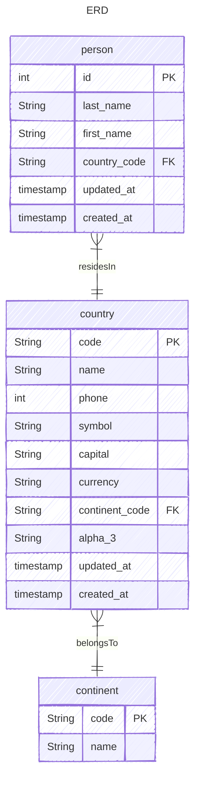

# JMicronaut

A sample RESTful backend API built with the Micronaut framework. It demonstrates a typical CRUD application using Micronaut Data JDBC, Flyway database migrations, and an embedded H2 database.

## Technology Stack

- **Language**: Java 25
- **Framework**: Micronaut 4.10.6
- **Build Tool**: Maven (wrapper included)
- **Runtime**: Netty (micronaut-http-server-netty)
- **Database**: H2 in-memory database
- **Data Access**: Micronaut Data JDBC with Hikari connection pool
- **Migrations**: Flyway
- **Serialization**: Micronaut Serde (Jackson)
- **Validation**: Jakarta Bean Validation (micronaut-validation)
- **Testing**: JUnit 5 with Micronaut Test
- **Logging**: Logback
- **Code Coverage**: JaCoCo
- **API Documentation**: OpenAPI (micronaut-openapi)

## Pre-requisites

- Java 25

## How to Run

1. Execute `./mvnw mn:run`
2. Database migration and seed data are executed automatically (disable this in `application.properties` if not needed)
3. The application starts on port `8080`
4. Call the API endpoint: `curl http://localhost:8080/persons`

The H2 web console is also started programmatically on a random port (see `Application.java`).

## Build

```bash
# Build the project and create the shaded JAR
./mvnw clean package
```

Code coverage report (JaCoCo) is generated automatically during the `prepare-package` phase.

## Tests

```bash
# Run all tests
./mvnw test
```

Tests use `@MicronautTest` for integration testing with the full application context. Controller tests exercise endpoints end-to-end via an HTTP client, and repository tests validate CRUD operations against the real database.

### HTTP Client Files

The `http/` directory contains IntelliJ HTTP Client request files for manual API testing:

```bash
http/
├── person.http
├── country.http
├── continent.http
└── http-client.env.json
```

Open any `.http` file in IntelliJ IDEA and click the run icon next to a request to execute it.

## API Overview

| Resource   | Endpoint              | Description                  |
|------------|-----------------------|------------------------------|
| Persons    | `GET /persons`        | Paginated list of persons    |
| Persons    | `GET /persons/{id}`   | Get a single person          |
| Persons    | `POST /persons`       | Create a new person          |
| Persons    | `PUT /persons/{id}`   | Update an existing person    |
| Countries  | `GET /countries`      | Paginated list of countries  |
| Countries  | `GET /countries/{code}` | Get a single country       |
| Continents | `GET /continents`     | List all continents          |
| Continents | `GET /continents/{code}` | Get a single continent    |

## Data Model


```mermaid
---
config:
  layout: dagre
  look: handDrawn
title: ERD
---
erDiagram
    person {
        int id PK ""  
        String last_name ""  
        String first_name ""  
        String country_code FK ""  
        timestamp updated_at ""  
        timestamp created_at ""  
    }
    country {
        String code PK ""  
        String name ""  
        int phone ""  
        String symbol ""  
        String capital ""  
        String currency ""  
        String continent_code FK ""  
        String alpha_3 ""  
        timestamp updated_at ""  
        timestamp created_at ""  
    }
    continent {
        String code PK ""  
        String name ""  
    }
    person}|--||country:"residesIn"
    country}|--||continent:"belongsTo"
```

## License

MIT License (see [LICENSE](LICENSE)).
