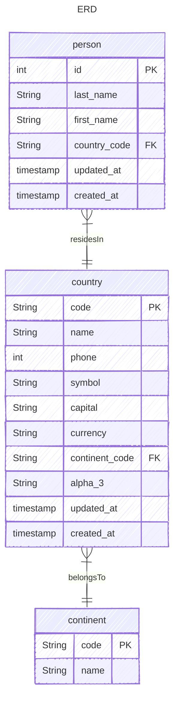

# JMicronaut

sample backend using Micronaut, Micronaut Data JDBC, and Flyway DB

## Pre-requisites
- java 25

## How to run
1. execute `./mvnw mn:run`
2. db migration is executed automatically including seed data (disable this on `application.yml` if not needed)
3. call the api endpoint `curl http://localhost:8080/persons`

## Tests
1. make sure main dependencies are installed
2. execute `./mvnw test`

## Data Model

